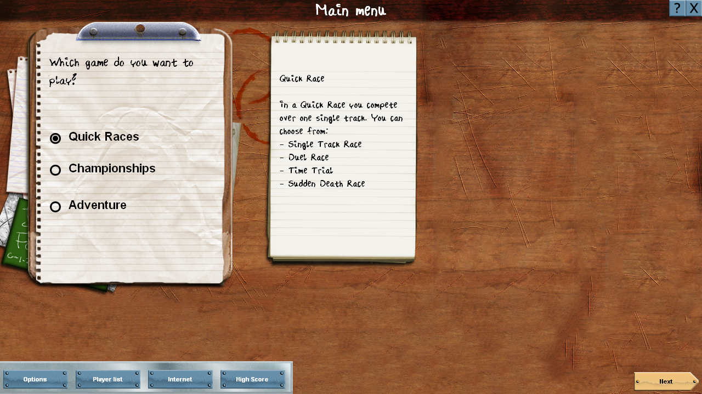
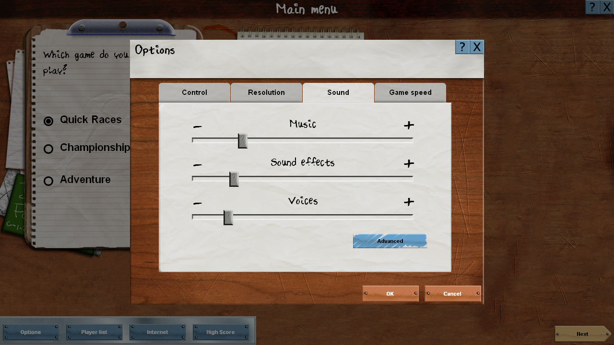
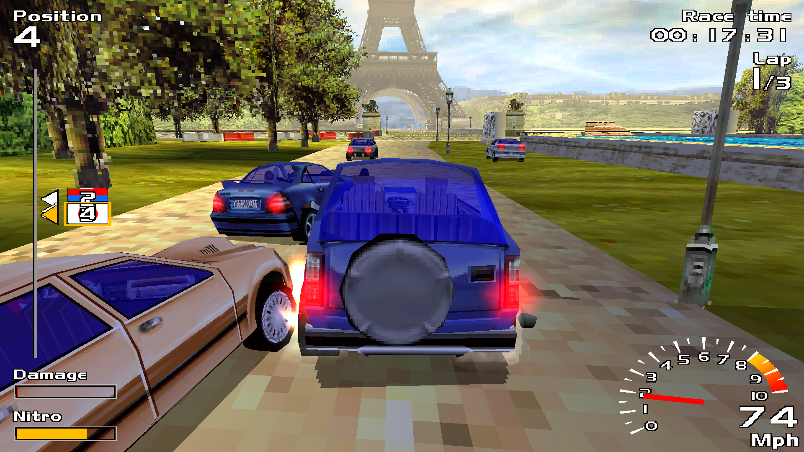
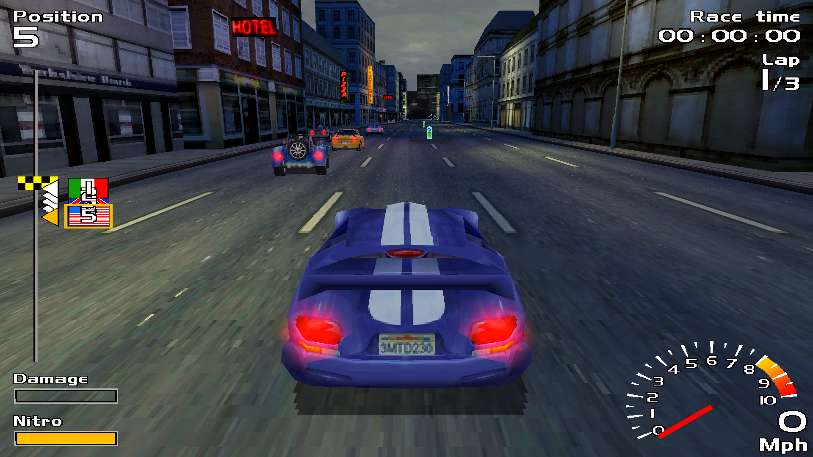
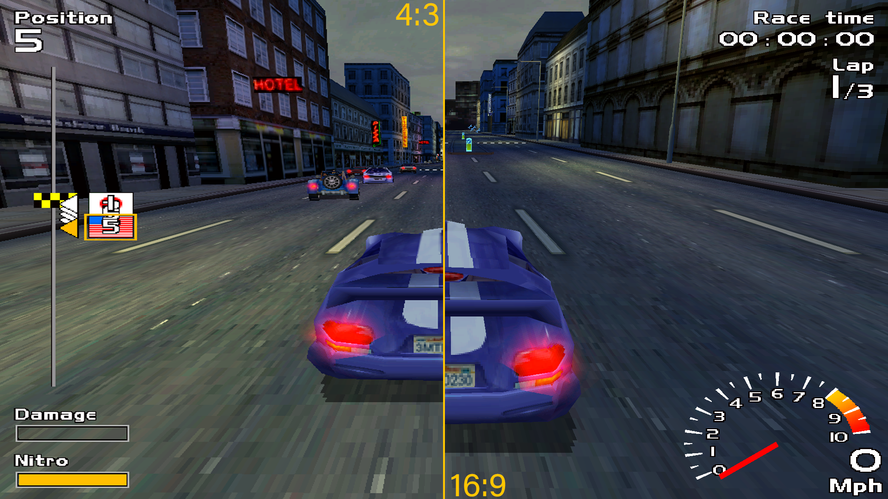

# Europe Racer Widescreen Fix
Widescreen fix for Europe Racer from Davilex Games.

This mod allows you to run the game in widescreen resolution.
The race will run with the resolution of your screen.
The main menu is only in 1280x720. The backgrounds are tailored for this resolution.
Memory for better quality textures has also been increased, as the game uses stripped-down versions of them.

# Installation
- Extract all files to the root folder of the game.

If you don't want to change the main menu, then don't copy the "Graphics" archive and the "scripts" folder in the "Menu" folder.

# Screenshots

